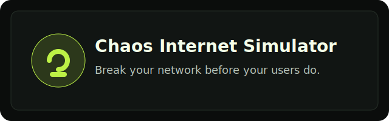

# Chaos Internet Simulator



**Break your network before your users do.**

[](./LICENSE)


Chaos Internet Simulator is an open source local proxy + dashboard + CLI to simulate real-world bad internet and unstable APIs during development.

## Why this project?

Most teams test with perfect localhost network. Production is not perfect.

Chaos Internet Simulator helps teams reproduce realistic failure modes early, before users see them.

## Who is this for?

- frontend developers validating loading/error states
- backend developers testing retries and idempotency
- QA and SRE teams stress-testing app resilience
- DX and platform teams creating reproducible failure drills

## Examples of what you can test

- slow navigation and high latency
- random API 5xx errors
- intermittent timeouts
- unstable HTTPS tunnels (CONNECT drops/timeouts)
- selective chaos by URL/path/domain
- scenario-based progressive degradation

## Demo (placeholder)

Demo GIF/recording will be added in a future release.

## Monorepo structure

```text
chaos-Internet-simulator/
├── apps/
│   ├── proxy/
│   ├── dashboard/
│   └── cli/
├── packages/
│   ├── core/
│   └── presets/
├── docs/
├── examples/
├── plugins/
├── recordings/
└── ...
```

## Installation

```bash
pnpm install
```

## Quick demo

```bash
pnpm dev
curl -x http://localhost:8080 https://jsonplaceholder.typicode.com/posts/1
```

## Local usage

```bash
cp .env.example .env
pnpm dev
```

Open:

- Dashboard: `http://localhost:3000`
- Proxy: `http://localhost:8080`
- Control API: `http://localhost:8081`

## Docker usage

```bash
docker compose up --build
```

## CLI usage

```bash
pnpm --filter @chaos-internet-simulator/cli build
pnpm --filter @chaos-internet-simulator/cli exec chaos-net status
pnpm --filter @chaos-internet-simulator/cli exec chaos-net start
pnpm --filter @chaos-internet-simulator/cli exec chaos-net profile unstable-api
pnpm --filter @chaos-internet-simulator/cli exec chaos-net logs
pnpm --filter @chaos-internet-simulator/cli exec chaos-net scenario bad-mobile-network
pnpm --filter @chaos-internet-simulator/cli exec chaos-net record start
pnpm --filter @chaos-internet-simulator/cli exec chaos-net record stop
pnpm --filter @chaos-internet-simulator/cli exec chaos-net replay sample.json
pnpm --filter @chaos-internet-simulator/cli exec chaos-net replay off
```

## cURL usage

```bash
curl -x http://localhost:8080 https://jsonplaceholder.typicode.com/posts
bash examples/curl_examples.sh
```

## Postman usage

Import:

- `examples/postman_collection.json`

Then configure proxy host `localhost` port `8080`.

## Axios / fetch usage

- Axios sample: `examples/node-axios-example.ts`
- fetch (undici) sample: `examples/node-fetch-example.ts`
- Full workflow guide: `docs/developer-workflows.md`

## HTTP_PROXY and HTTPS_PROXY

```bash
export HTTP_PROXY=http://localhost:8080
export HTTPS_PROXY=http://localhost:8080
```

## chaos.config.json

Supported fields:

- `enabled`
- `activeProfile`
- `targetBaseUrl`
- `proxyPort`
- `controlApiPort`
- `rules`
- `customProfiles`

Example:

```json
{
  "enabled": true,
  "activeProfile": "slow-3g",
  "targetBaseUrl": "https://jsonplaceholder.typicode.com",
  "proxyPort": 8080,
  "controlApiPort": 8081,
  "rules": [{ "match": "/posts", "profile": "slow-3g" }],
  "customProfiles": {
    "my-bad-network": {
      "delayMs": 3500,
      "errorRatePercent": 10,
      "timeoutRatePercent": 5,
      "timeoutMs": 12000
    }
  }
}
```

Priority:

1. env vars
2. `chaos.config.json`
3. defaults

## Available profiles

- `normal`
- `slow-3g`
- `airport-wifi`
- `unstable-api`
- `total-chaos`
- `starbucks-wifi`
- `colombia-4g`
- `office-vpn`
- `international-latency`
- `road-trip-network`

## Scenarios

- `bad-mobile-network` (loop)
- `api-degrading`

## HTTPS support and limitations

- HTTPS traffic is supported through CONNECT tunneling.
- Chaos can apply delay, timeout, forced error, and connection drop before tunnel establishment.
- MITM is intentionally not implemented in this phase.
- Encrypted HTTPS payload is not inspected or rewritten.

## Dashboard

Dashboard provides:

- chaos on/off and active profile controls
- target URL and per-route rule editor
- custom profile editor
- real-time logs
- metrics overview cards
- Playwright E2E tests for key flows (render, toggle, config updates)

## UI Library (`@florexlabs/ui`)

Dashboard now uses `@florexlabs/ui` as the reusable UI base.

Migrated components:

- `Button`
- `Card`
- `Badge`
- `Input`
- `Container`
- `Section`
- `Spinner`
- `EmptyState`

Still local (by design):

- native select controls in profile/rules forms (simple keyboard-native behavior)
- request log table structure and density styles (proxy-specific data layout)

Basic usage example:

```tsx
import { Badge, Button, Card, Input } from '@florexlabs/ui';
```

## Metrics

`GET /metrics` exposes:

- totalRequests
- delayedRequests
- erroredRequests
- timedOutRequests
- throttledRequests
- droppedConnections
- averageResponseTimeMs
- activeProfile
- activeScenario
- chaosEnabled

## Plugins

- Local plugins loaded from `plugins/`
- Hooks: `onRequest`, `onResponse`
- Capabilities: `forceError`, `addDelay`, `skipChaos`, `setHeader`, `dropConnection`
- Plugin failures are isolated and logged

See:

- `docs/plugins.md`
- `plugins/random-auth-failure.example.ts`

## Record & Replay

Control API:

- `POST /record/start`
- `POST /record/stop`
- `POST /replay/start`
- `POST /replay/stop`

Recordings are JSON files under `recordings/`.

## Control API

- `GET /health`
- `GET /state`
- `POST /state/enabled`
- `POST /state/profile`
- `POST /state/rules`
- `POST /state/target-base-url`
- `GET /logs`
- `GET /metrics`
- `GET /profiles`
- `POST /profiles/custom`
- `GET /scenario`
- `GET /scenarios`
- `POST /scenario`
- `POST /scenario/off`
- `POST /record/start`
- `POST /record/stop`
- `POST /replay/start`
- `POST /replay/stop`

## Detailed docs

- `docs/README.md`
- `docs/proxy.md`
- `docs/dashboard.md`
- `docs/cli.md`
- `docs/configuration.md`
- `docs/developer-workflows.md`
- `docs/plugins.md`
- `docs/ui-system.md`

## Scripts

- `pnpm dev`
- `pnpm build`
- `pnpm test`
- `pnpm lint`
- `pnpm format`

## Roadmap

- optional MITM HTTPS mode
- richer scenario editor in dashboard
- plugin marketplace ideas
- HAR import/export helpers

## Contributing

See `CONTRIBUTING.md`.

## License

MIT (`LICENSE`)
